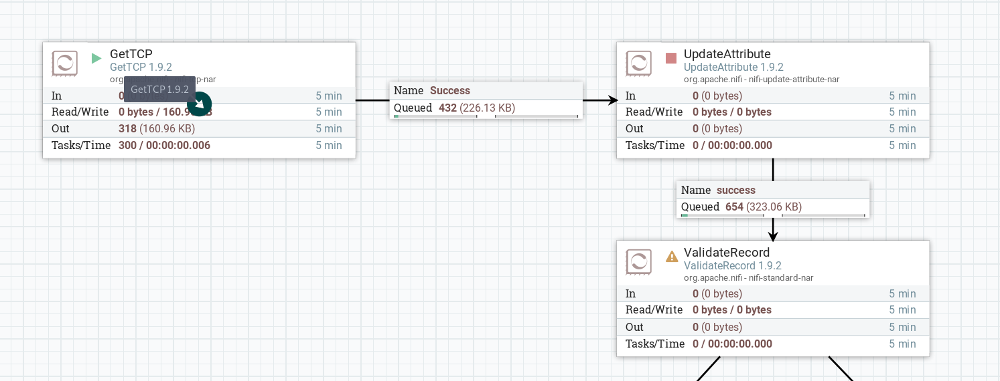

# NiFi + Kafka development lab

The goal of this lab are to:
- Read the NYC Taxi datasets from sockets with NiFi
- Validate and convert the datasets to Avro format
- Write the datasets to Kafka
- Filter the rides dataset with NiFi and write it to Kafka

## Usefull links

- [Kafka Quick Start doc](http://kafka.apache.org/21/documentation.html#quickstart)
- [NiFi Getting Started doc](https://nifi.apache.org/docs/nifi-docs/html/getting-started.html)

## Prerequisites

Before you can start the lab, you have to complete the NiFi+Kafka install from the [previous lab](../nifi-kafka-vm/README.md).

## Lab

1. Copy the [ece-spark](https://github.com/adaltas/ece-spark) repository to your VM (in `/tmp` for example)
2. Stream the datasets to a socket using the Python script
3. Develop the first dataflow that reads the records from the sockets, convert them to Avro and writes them to Kafka
   1. Connect to NiFi: [http://20.20.20.21:8080/nifi](http://20.20.20.21:8080/nifi)
   2. Create a `GetTCP` processor to read data from the socket
      1. Properties: `Endpoint List = localhost:SOCKER_PORT`, `End of message delimiter byte = 10`
      2. Settings: `Automatically terminate relationships = Partial`
   3. Create a `UpdateAttribute` and a `ValidateRecord` processor
   4. Link the `GetTCP` `Success` relationship to the `UpdateAttribute` processor
   5. Start the `GetTCP` processor, FlowFiles should start queuing in the `Success` queue
   
   6. Add an attribute to the `UpdateAttribute` processor: `schema.name = nyc_taxi_fares`
